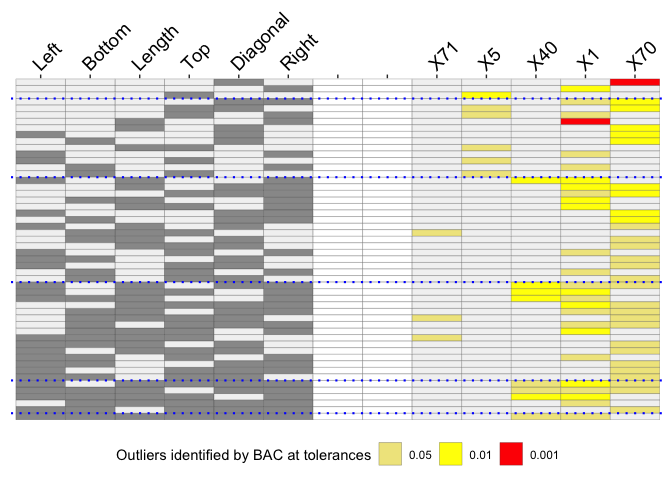

<!-- README.md is generated from README.Rmd. Please edit that file -->

# OutliersO3

OutliersO3 is for visualising results of outlier analyses. Overview of
Outliers (O3) plots show which cases are identified as potential
outliers for different combinations of variables from a dataset.

You can compare sets of outliers identified by up to six different
methods. You can also compare results for a single method at up to three
different tolerance
levels.

## Install in the usual way

install.packages(“OutliersO3”)

## What outliers are there amongst the genuine banknotes in the Swiss banknote dataset?

Flury and Riedwyl introduced the famous banknote dataset in their
excellent book on multivariate statistics. There are measurements on 100
genuine banknotes and on 100 counterfeit banknotes. Presumably the
genuine notes should all be very similar.

The method mvBACON from *robustX* has been used to identify possible
outliers. There are 6 numeric measurements of the notes, so there are 63
possible variable combinations. An O3 plot has one row for each variable
combination for which outliers were found and those variables are
specified by the relevant columns on the left of the plot. The cases
identified as outliers for at least one combination each get a column to
the right of the plot.

``` r
library(OutliersO3)
#> Registered S3 method overwritten by 'GGally':
#>   method from   
#>   +.gg   ggplot2
data(banknote, package="mclust")
data <- banknote %>% filter(Status=="genuine") %>% select(-Status)
pB <- O3prep(data, method="BAC", tols=c(0.05, 0.01, 0.001), boxplotLimits=c(6,10,12))
pX <- O3plotT(pB)
#> Warning: Vectorized input to `element_text()` is not officially supported.
#> Results may be unexpected or may change in future versions of ggplot2.
pX$gO3
```

<!-- -->

The O3 plot shows outliers found by the mvBACON method for three
tolerance levels. Two banknotes, X71 and X5, are only identified for a
few combinations mainly at a level of 0.05. A further banknote, X40 is
identified more often, mostly at a level of 0.01. Two banknotes, X1 and
X70, were identified as outliers at a level of 0.001 for the combination
of attributes Length and Right and for Diagonal on its own respectively.
When X1 is identified as an outlier at other levels the attribute Right
is always involved. The supporting parallel coordinate plot suggests
why:

``` r
pX$gpcp
```

<!-- -->

This plot also suggests that all five cases identified as potential
outliers are relatively extreme on at least one of the six attributes.

There are more examples in the package vignettes.
